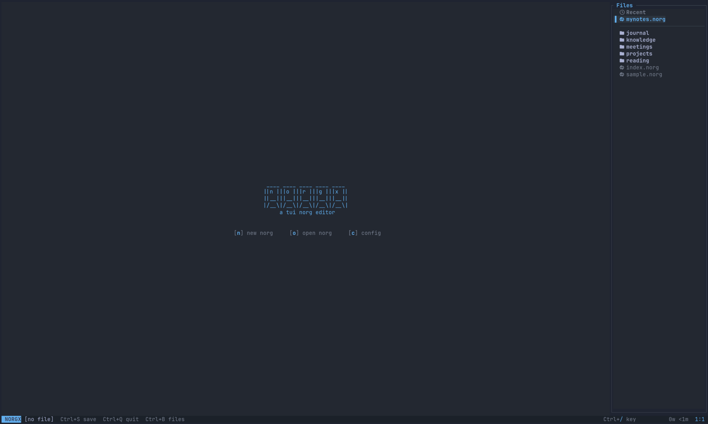
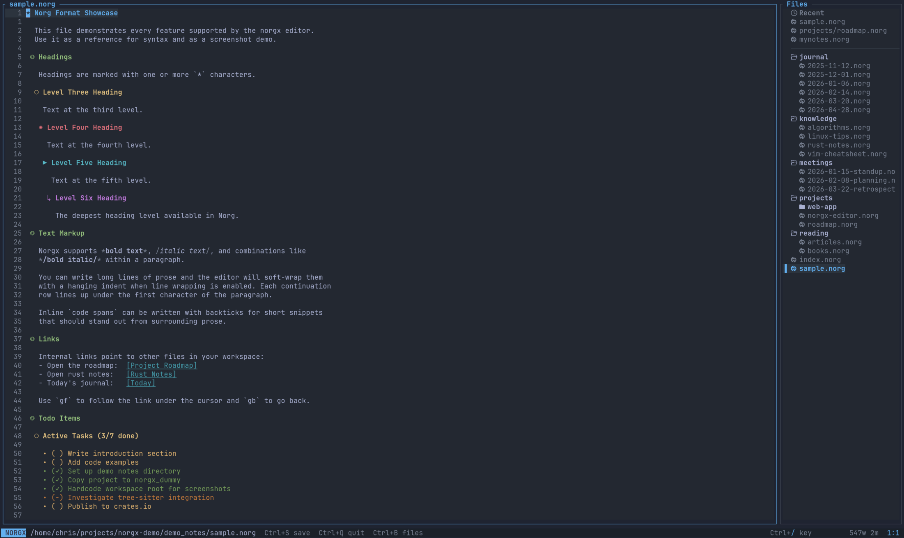

# norgx


A terminal editor for the [Norg](https://github.com/nvim-neorg/neorg) file format.

No more lua, plugin managers, or treesitter dependencies. Just install and start norging...



---

## Features

- **Syntax highlighting** — headings, todos, bold, italic, links, code blocks
- **Todo cycling** — `Ctrl+T` to step through `( )` → `(x)` → `(-)` states; heading lines show a live `(done/total)` progress count
- **Heading navigation** — `]h` / `[h` to jump between headings, `za` to fold/unfold
- **Link following** — `gf` opens `{:link:}` targets, `gb` goes back
- **Journal** — `Ctrl+J` opens or creates today's dated entry
- **PDF export** — `Ctrl+P` converts the current file to PDF via `xelatex` (requires `xelatex` installed)
- **File tree** — collapsible workspace sidebar with fuzzy search (`/`)
- **In-file search** — `Ctrl+F` with live match highlighting
- **Line wrapping** — optional soft-wrap with hanging indent
- **Relative line numbers** — optional Vim-style relative gutter
- **Configurable** — colors, fonts, tab width, auto-save, and more via a single TOML file



---

## Installation

### From crates.io

```
cargo install norgx
```

### From source

```
git clone https://github.com/neotermx/norgx
cd norgx
cargo install --path .
```

---

## First run

Run the setup command once to create your notes directory and a default config file:

```
norgx --setup
```

This creates:
- `~/notes/` — your workspace (a `welcome.norg` file is added)
- `~/.config/norgx/config.toml` — fully documented config with all options commented

Then just run `norgx` to open the launcher, or open a file directly:

```
norgx ~/notes/my-file.norg
```

---

## Usage

| Key | Action |
|-----|--------|
| `Ctrl+S` | Save |
| `Ctrl+Q` | Quit |
| `Ctrl+O` | Open file |
| `Ctrl+N` | New scratch buffer |
| `Ctrl+B` | Toggle / focus file tree |
| `Ctrl+\` | Hide / show file tree |
| `Ctrl+F` | In-file search |
| `Ctrl+T` | Cycle TODO state |
| `Ctrl+J` | Open today's journal entry |
| `Ctrl+P` | Export to PDF |
| `Ctrl+Z` | Undo |
| `Ctrl+Y` | Redo |
| `]h` / `[h` | Next / previous heading |
| `za` | Fold / unfold heading |
| `gf` | Follow link under cursor |
| `gb` | Go back after following a link |
| `Esc` | Keybindings reference |

Press `Esc` at any time to see the full keybindings screen.

---

## Configuration

The config file lives at `~/.config/norgx/config.toml`. Every option is optional — norgx works out of the box without one. Run `norgx --setup` to get a fully documented template.

```toml
[editor]
line_numbers = true
relative_line_numbers = false
tab_width = 4
line_wrap = false
conceal_headings = true
conceal_todos = true
conceal_links = true
show_todo_progress = true
# auto_save_secs = 30

[ui]
accent_color = "#61AFEF"
file_tree_width = 30
heading_colors = ["#61AFEF", "#98C379", "#E5C07B", "#E06C75", "#56B6C2", "#C678DD"]
heading_glyphs = ["◉", "◎", "○", "✺", "▶", "↳"]

[journal]
date_format = "%Y-%m-%d"
# dir = "~/notes/journal"
# template = "* {date}\n\n"

[pdf]
viewer = "xdg-open"
font = "JetBrainsMono Nerd Font"
font_size = 10.5
margin = "1in"
```

---

## Optional runtime dependencies

norgx is a single binary with no required runtime dependencies. These tools unlock optional features:

| Tool | Feature |
|------|---------|
| `xelatex` | PDF export (`Ctrl+P`) |
| `wl-copy` / `xclip` | System clipboard (`Ctrl+C`, `Ctrl+X`, `Ctrl+V`) |

---

## License

MIT — see [LICENSE](LICENSE).
